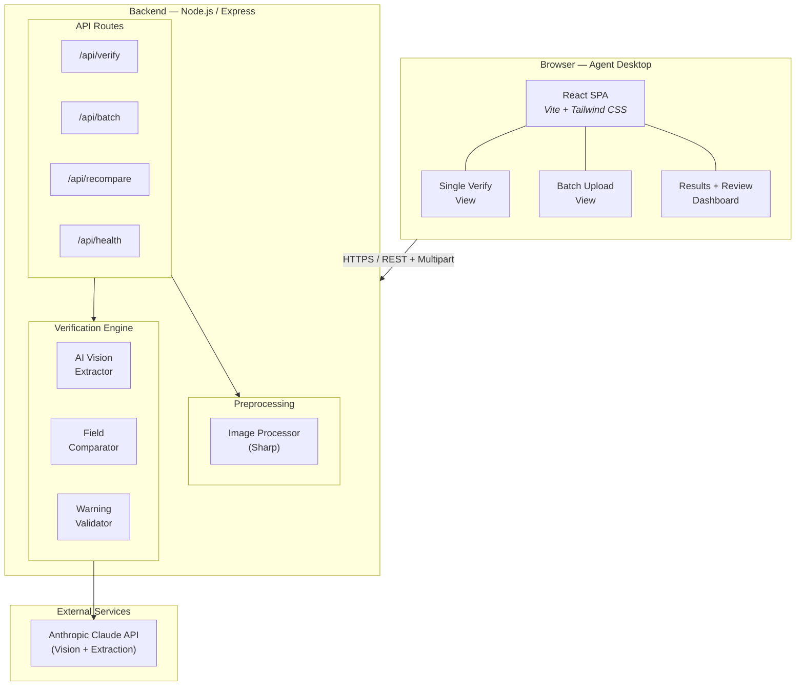
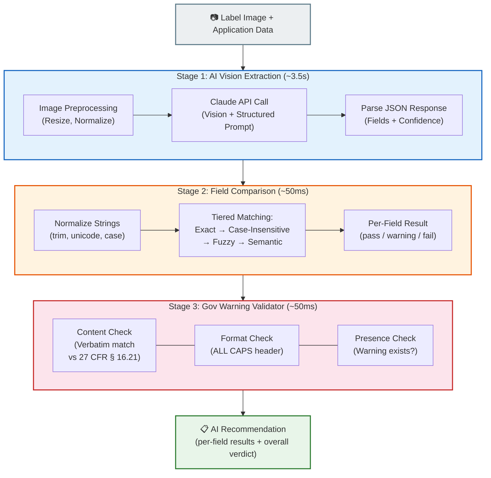
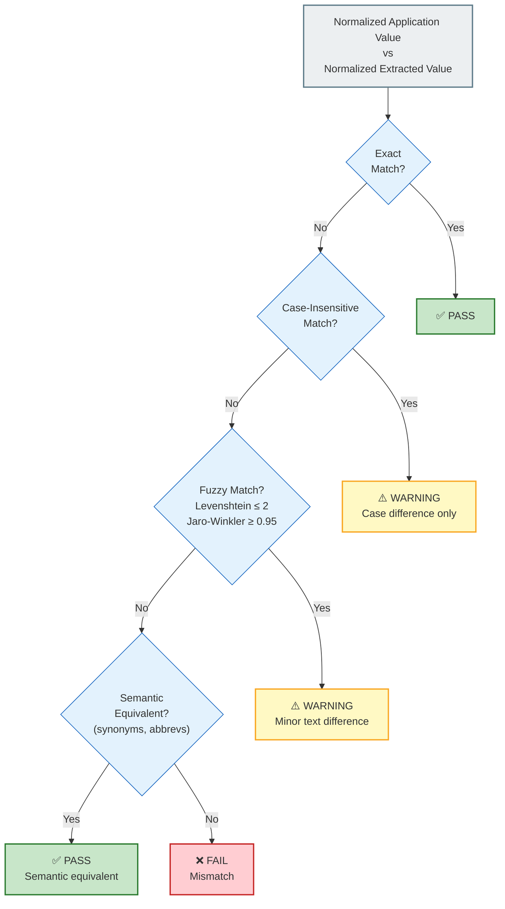
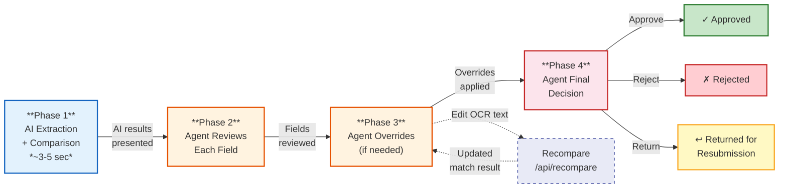

# Design Document: AI-Powered Alcohol Label Verification App

## 1. Requirements Analysis

### 1.1 Extracted Functional Requirements

The following requirements are derived from stakeholder interviews and the technical specification.

#### Core (Must-Have)

| ID | Requirement | Source |
|----|-------------|--------|
| FR-1 | Upload a label image and extract text/data from it using OCR/AI vision | Sarah Chen, Jenny Park |
| FR-2 | Accept structured application data (brand name, class/type, ABV, net contents, government warning, producer info, country of origin) for comparison | Technical Requirements |
| FR-3 | Compare extracted label fields against application data and report match/mismatch per field | Sarah Chen ("a lot of what we do is just matching") |
| FR-4 | Validate the Government Health Warning Statement is present, word-for-word correct, and formatted properly (all-caps bold "GOVERNMENT WARNING:") | Jenny Park |
| FR-5 | Return verification results within ~5 seconds | Sarah Chen ("if we can't get results back in about 5 seconds, nobody's going to use it") |
| FR-6 | Support single-label upload workflow (the primary daily use case) | All stakeholders |
| FR-7 | Handle common image quality issues: moderate angle skew, uneven lighting, minor glare | Jenny Park |
| FR-8 | **Human-in-the-loop review**: After AI produces verification results, the agent can review each field judgment and override it (change pass→fail, fail→pass, or warning→pass/fail) with a required justification note | Dave Morrison ("You need judgment"), confidence-building for adoption |
| FR-9 | Allow the agent to correct the AI's extracted text for any field before re-running comparison, so that OCR errors don't cascade into false mismatches | Jenny Park (image quality concerns), Dave Morrison |
| FR-10 | Provide a final "Approve" / "Reject" / "Return for Resubmission" decision that the agent explicitly confirms — the AI's verdict is always a *recommendation*, never an automatic decision | Compliance workflow (agents are accountable for decisions) |

#### Important (Should-Have)

| ID | Requirement | Source |
|----|-------------|--------|
| FR-11 | Batch upload: accept multiple label images + a manifest of application data, process in bulk, and present aggregated results | Sarah Chen ("handle batch uploads… Janet from Seattle has been asking about this for years") |
| FR-12 | Apply intelligent/fuzzy matching for trivial discrepancies — e.g., case-only differences like "STONE'S THROW" vs "Stone's Throw" — and flag them as soft warnings rather than hard failures | Dave Morrison |
| FR-13 | Display a field-by-field results summary with clear pass/fail/warning status | Evaluation criteria (UX, error handling) |
| FR-14 | Allow the agent to add free-text annotations to the overall verification for context or edge-case documentation | Implied by Dave Morrison's "judgment" comments |

#### Nice-to-Have (Could-Have)

| ID | Requirement | Source |
|----|-------------|--------|
| FR-15 | Show the extracted text overlaid or side-by-side with the original image for visual confirmation | Implied by agent workflow |
| FR-16 | Export/download a verification report (PDF or CSV) including any agent overrides and notes | Implied for audit trail / batch use |
| FR-17 | Support multiple beverage types (beer, wine, spirits) with type-specific validation rules | TTB context section |

### 1.2 Non-Functional Requirements

| ID | Requirement | Source |
|----|-------------|--------|
| NFR-1 | Response latency ≤ 5 seconds for a single label verification | Sarah Chen |
| NFR-2 | Extremely simple, accessible UI — minimal training required; usable by agents with low tech comfort | Sarah Chen ("something my mother could figure out") |
| NFR-3 | Standalone deployment; no integration with COLA or internal TTB systems | Marcus Williams |
| NFR-4 | No storage of PII or sensitive data for the prototype | Marcus Williams |
| NFR-5 | Deployable as a web app accessible via standard browsers (compatible with government-locked-down desktops) | Implied by Azure infrastructure, agent demographic |
| NFR-6 | Graceful error handling — clear, human-readable messages on failure, never raw stack traces | Evaluation criteria |
| NFR-7 | Mobile-friendly is not required (desktop-first; agents work at desks) | Implied by workflow |

### 1.3 Assumptions

1. The prototype will use a cloud-hosted LLM with vision capability (e.g., Claude or GPT-4o) as the AI backbone. In a production deployment, this would need to be replaced or approved under FedRAMP, but is acceptable for a proof-of-concept per Marcus Williams.
2. Label images are primarily JPG/PNG photographs or scans, typically 1–10 MB.
3. The "application data" is entered manually by the agent (or pasted from COLA) into a form. There is no API integration with COLA.
4. The standard Government Health Warning text is the federally mandated statement per 27 CFR § 16.21.
5. Batch upload will cap at ~300 labels per batch (the upper bound Sarah mentioned).
6. The prototype does not need authentication or role-based access — it's an internal tool on a trusted network.

### 1.4 Out of Scope

- Direct integration with the COLA system.
- Long-term storage, audit logging, or document retention.
- User authentication / authorization.
- Accessibility compliance beyond basic usability (full Section 508 audit deferred to production).

---

## 2. Architecture

### 2.1 High-Level Architecture



### 2.2 Technology Choices

| Layer | Choice | Rationale |
|-------|--------|-----------|
| Frontend | React + Vite + Tailwind CSS | Fast dev cycle; Tailwind enables clean accessible UI without custom CSS overhead; React ecosystem is mature for form-heavy apps |
| Backend | Node.js + Express | Lightweight, fast to prototype, good async I/O for proxying AI API calls; TypeScript for type safety |
| AI/Vision | Anthropic Claude (claude-sonnet-4-20250514) via Messages API with vision | Strong vision + structured extraction in a single call; fast enough to hit the 5s target; the `image` content block handles label photos natively |
| Deployment | Vercel (frontend) + Railway or Render (backend) | Free/cheap tiers for prototype; HTTPS by default; easy CI/CD from GitHub |
| Image handling | Sharp (Node.js) | Pre-process images (resize, normalize) before sending to the LLM to reduce latency and token cost |

### 2.3 Why a Vision LLM Over Traditional OCR + NLP

Traditional pipeline (Tesseract/Google Vision OCR → NLP parsing → rule-based matching) was considered and rejected for the prototype because:

1. **Accuracy on curved/angled labels**: Vision LLMs handle bottles, curved surfaces, and skewed photos significantly better than traditional OCR without a separate deskew/preprocessing pipeline.
2. **Structured extraction in one step**: A single LLM call can return structured JSON with all fields identified, eliminating the brittle NLP parsing step.
3. **Semantic matching built-in**: The LLM can be prompted to distinguish meaningful differences from trivial formatting ones (the Dave Morrison problem), reducing post-processing logic.
4. **Development speed**: One integration point rather than three.

The trade-off is cost per call and dependency on an external API. Acceptable for a prototype.

---

## 3. Detailed Design

### 3.1 API Design

#### `POST /api/verify`

Single label verification.

**Request** (multipart/form-data):
```
image: File (jpg/png, max 10MB)
application: JSON string {
  brandName: string,
  classType: string,
  alcoholContent: string,
  netContents: string,
  governmentWarning: string,
  producerName: string,
  producerAddress: string,
  countryOfOrigin: string
}
```

**Response** (JSON):
```json
{
  "aiRecommendation": "fail",
  "processingTimeMs": 3200,
  "reviewRequired": true,
  "extractedFields": {
    "brandName": { "value": "OLD TOM DISTILLERY", "confidence": "high" },
    "classType": { "value": "Kentucky Straight Bourbon Whiskey", "confidence": "high" },
    "alcoholContent": { "value": "45% Alc./Vol. (90 Proof)", "confidence": "high" },
    "netContents": { "value": "750 mL", "confidence": "high" },
    "governmentWarning": { "value": "GOVERNMENT WARNING: (1) According to...", "confidence": "medium" },
    "producerName": { "value": "Old Tom Distillery Co.", "confidence": "high" },
    "producerAddress": { "value": "Louisville, KY", "confidence": "medium" },
    "countryOfOrigin": { "value": null, "confidence": "low" }
  },
  "fieldResults": [
    {
      "field": "brandName",
      "status": "pass",
      "applicationValue": "OLD TOM DISTILLERY",
      "extractedValue": "OLD TOM DISTILLERY",
      "note": "Exact match"
    },
    {
      "field": "governmentWarning",
      "status": "fail",
      "applicationValue": "GOVERNMENT WARNING: ...",
      "extractedValue": "Government Warning: ...",
      "note": "Header must be ALL CAPS. Found title case."
    }
  ],
  "overallNotes": [
    "Government Warning formatting does not meet 27 CFR § 16.21 requirements."
  ]
}
```

#### `POST /api/batch`

Batch verification. Accepts a zip file or multiple files.

**Request** (multipart/form-data):
```
images: File[] (multiple label images)
manifest: JSON file mapping filenames to application data
```

**Response** (JSON):
```json
{
  "batchId": "b-123",
  "totalLabels": 12,
  "passed": 8,
  "failed": 3,
  "warnings": 1,
  "results": [ /* array of individual verify responses */ ]
}
```

Processing: Labels are verified concurrently (up to 5 parallel AI calls) to stay within rate limits while maximizing throughput.

#### `POST /api/recompare`

Re-run field comparison after the agent corrects an extracted value. This is a lightweight call — no AI/vision involved, just the deterministic comparison logic.

**Request** (JSON):
```json
{
  "field": "brandName",
  "applicationValue": "OLD TOM DISTILLERY",
  "correctedExtraction": "OLD TOM DISTILLERY"
}
```

**Response** (JSON):
```json
{
  "field": "brandName",
  "status": "pass",
  "note": "Exact match (after agent correction)"
}
```

This endpoint exists so that when an agent fixes an OCR misread in the UI, they get immediate feedback on whether the corrected text now matches — without re-uploading the image or waiting for another AI call.

### 3.2 Verification Engine

The engine has three stages that run sequentially per label:



#### Stage 1: AI Vision Extraction

A single call to the Claude API with the label image and a structured extraction prompt.

**Prompt strategy:**
```
System: You are a TTB alcohol label compliance analyst. Extract all
visible text fields from this label image. Return a JSON object with
these keys: brandName, classType, alcoholContent, netContents,
governmentWarning (full verbatim text), producerName, producerAddress,
countryOfOrigin. For each field, include the extracted "value" (null if
not found) and a "confidence" level (high/medium/low). Do not guess —
if a field is unclear, set confidence to low and include what you can
read. Return ONLY valid JSON, no markdown.
```

The prompt is kept focused and directive to minimize latency (fewer output tokens = faster response). Temperature is set to 0 for deterministic extraction.

#### Stage 2: Field Comparison

Each extracted field is compared to the corresponding application field using a tiered matching strategy:

| Match Level | Logic | Result |
|-------------|-------|--------|
| **Exact** | Normalized strings are identical (after trimming whitespace) | `pass` |
| **Case-insensitive** | Strings match ignoring case | `warning` with note "Case difference only" |
| **Fuzzy** | Levenshtein distance ≤ 2 or Jaro-Winkler similarity ≥ 0.95 | `warning` with note describing difference |
| **Semantic** | For specific fields (class/type), known synonyms or abbreviations are equivalent (e.g., "Alc./Vol." vs "Alcohol by Volume") | `pass` with note |
| **Mismatch** | None of the above | `fail` |

Normalization steps applied before comparison: trim whitespace, collapse multiple spaces, normalize unicode quotes/dashes.



#### Stage 3: Government Warning Validator

This is a dedicated check because the warning has strict formatting requirements beyond content matching:

1. **Content check**: Verbatim comparison against the standard warning text (27 CFR § 16.21). Uses exact string matching after normalization. Any word-level deviation is a `fail`.
2. **Format check**: The extracted text for "GOVERNMENT WARNING:" must appear in all caps. If the AI reports title case, mixed case, or lowercase, it's a `fail`.
3. **Presence check**: If the warning is missing entirely from the label, it's a `fail` with a specific note.

The bold requirement cannot be reliably verified from a photograph (font weight detection from images is unreliable), so this is noted as a limitation the agent should manually verify.

### 3.3 Image Preprocessing

Before sending to the AI, images are processed with Sharp:

1. **Resize**: If the image exceeds 2048px on the longest side, downscale proportionally. This reduces API latency and cost without meaningfully hurting extraction quality.
2. **Format normalize**: Convert HEIC/TIFF/BMP to JPEG. Most LLM vision APIs accept JPEG/PNG natively.
3. **Quality check**: If the image is below 200px on any dimension, reject with a helpful error asking for a higher-resolution image.

Heavy-duty preprocessing (deskew, deglare, perspective correction) is deliberately omitted for the prototype — the vision LLM handles moderate distortion well, and adding OpenCV would increase complexity and build time.

### 3.4 Latency Budget

Target: ≤ 5,000 ms end-to-end.

| Step | Budget | Notes |
|------|--------|-------|
| Image upload & preprocessing | 300 ms | Resize on server, user's upload speed is external |
| AI Vision API call | 3,500 ms | The dominant cost; Claude Sonnet with a single image typically responds in 2–4s |
| Field comparison logic | 50 ms | Pure string operations, negligible |
| Warning validation | 50 ms | Pure string operations |
| Response serialization + network | 100 ms | |
| **Buffer** | **1,000 ms** | |

If latency consistently exceeds budget, mitigations (in priority order):
1. Reduce image resolution sent to API (smaller payload = faster).
2. Switch to a faster/smaller model if one becomes available.
3. Cache the government warning reference text (trivial, but eliminates one variable).

### 3.5 Human-in-the-Loop Review Flow

This is the core interaction model for the application. The AI is an assistant, not a decision-maker. Every verification goes through a four-phase lifecycle:



**Phase 1 — AI Extraction + Comparison** (automated, ~3–5s): The system extracts label text, compares it to application data, and produces a per-field recommendation (pass/warning/fail) plus an overall recommendation. This is clearly labeled as "AI Recommendation" — never as a decision.

**Phase 2 — Agent Field Review** (human required): The agent sees the AI's results in a side-by-side table. Each row shows the application value, the extracted label value, and the AI's judgment. The extracted value is displayed in an editable text field so the agent can correct OCR errors inline (FR-9). Crucially, the agent can see the original label image alongside the results table at all times for visual cross-reference.

**Phase 3 — Agent Override** (human, as needed): For any field where the agent disagrees with the AI, they can change the status via a dropdown (pass/warning/fail). When overriding, a justification text field expands and is required — the agent must briefly explain why. This creates an implicit record of where the AI got it wrong and why, which is valuable for building trust and for future model improvement. Common override scenarios:

- AI flags a case-only mismatch as "fail" → Agent overrides to "pass" with note: "Case-insensitive match, same brand."
- AI says "pass" on a fuzzy match → Agent overrides to "fail" with note: "These are different products despite similar names."
- AI confidence is low on a field → Agent corrects the extracted text, system re-runs comparison, agent confirms.

**Phase 4 — Agent Final Decision** (human required): After reviewing all fields, the agent must make an explicit final decision by clicking one of three buttons: "Approve", "Reject", or "Return for Resubmission." This step is mandatory — the UI does not allow the agent to simply close the results. The final decision is independent of the AI's recommendation; an agent can approve a label that the AI flagged as "fail" or reject one the AI said "pass" on.

#### Why This Matters

This design addresses several stakeholder concerns simultaneously:

- **Dave Morrison's "judgment" concern**: The AI doesn't replace judgment — it front-loads the tedious matching work so agents can focus their judgment on the ambiguous cases.
- **Adoption / trust building**: Agents who are skeptical of AI (Dave) can override freely. Over time, as they see the AI getting it right, trust builds organically. Agents who are enthusiastic (Jenny) can move faster through easy labels while still having final sign-off.
- **Accountability**: The agent's name is on the decision, not the AI's. This is critical for a government compliance workflow.
- **Feedback signal**: Every override is an implicit signal about where the AI's matching logic needs improvement, enabling targeted refinement post-prototype.

#### State Model

Each verification session has the following state:

```typescript
interface VerificationSession {
  // Phase 1 output (immutable once set)
  aiExtraction: ExtractedFields;
  aiFieldResults: FieldResult[];
  aiRecommendation: "pass" | "fail" | "warning";

  // Phase 2-3 agent edits (mutable)
  agentFieldOverrides: {
    [fieldName: string]: {
      correctedExtraction?: string;  // Agent-edited OCR text
      overrideStatus?: "pass" | "fail" | "warning";
      justification: string;         // Required when overriding
    };
  };
  agentNotes: string;  // Free-text overall notes

  // Phase 4 decision (set once, finalizes the session)
  agentDecision: "approve" | "reject" | "return" | null;
  decidedAt: string | null;  // ISO timestamp
}
```

This entire object lives in React state on the client for the prototype (no server-side persistence). The export feature (FR-16) serializes it to CSV/JSON so the agent has a record.

---

## 4. Frontend Design

### 4.1 Design Principles

Driven directly by Sarah Chen's mandate ("something my mother could figure out") and the agent demographic (half over 50, wide tech-comfort range):

1. **AI recommends, humans decide**: The AI's output is always presented as a recommendation, never a final decision. The agent has the last word on every field and the overall verdict. Visual language reinforces this — "AI Recommendation" header, not "Result."
2. **Big, obvious actions**: Primary buttons are large, high-contrast, and labeled with verbs ("Verify Label", "Upload Batch", "Approve", "Reject"). No icon-only buttons.
3. **Linear flow**: The single-verify workflow is a four-step linear process — upload image → enter application data → review AI results + override as needed → submit final decision. No tabs, no modals, no hidden menus.
4. **Progressive disclosure**: Advanced features (batch upload, export) are accessible but not prominent. Override controls expand inline only when the agent clicks to change a judgment — they don't clutter the default view.
5. **Clear status language**: Results use plain English ("Match", "Mismatch — case difference only", "Missing from label") with color coding (green/yellow/red). No codes or jargon. When an agent overrides, the original AI judgment remains visible (struck through) so the change is transparent.
6. **Forgiving inputs**: Drag-and-drop or click-to-upload for images. Paste-friendly text fields. No strict input formatting requirements.

### 4.2 Page Layout

The app is a single-page application with two primary views accessible via a simple top-level toggle (not a deep nav):

#### View 1: Single Label Verification (Default)

```
┌──────────────────────────────────────────────────────────────┐
│  [Logo] TTB Label Verification Tool        [Single] [Batch]  │
├──────────────────────────────────────────────────────────────┤
│                                                              │
│  ┌─── Step 1: Upload Label Image ───────────────────────┐   │
│  │                                                       │   │
│  │     ┌───────────────────────────────────┐             │   │
│  │     │                                   │             │   │
│  │     │   Drag & drop label image here    │             │   │
│  │     │       or click to browse          │             │   │
│  │     │                                   │             │   │
│  │     │   [thumbnail preview after drop]  │             │   │
│  │     └───────────────────────────────────┘             │   │
│  └───────────────────────────────────────────────────────┘   │
│                                                              │
│  ┌─── Step 2: Application Data ─────────────────────────┐   │
│  │                                                       │   │
│  │  Brand Name:        [ OLD TOM DISTILLERY            ] │   │
│  │  Class/Type:        [ Kentucky Straight Bourbon...  ] │   │
│  │  Alcohol Content:   [ 45% Alc./Vol. (90 Proof)     ] │   │
│  │  Net Contents:      [ 750 mL                        ] │   │
│  │  Producer Name:     [ Old Tom Distillery Co.        ] │   │
│  │  Producer Address:  [ Louisville, KY                ] │   │
│  │  Country of Origin: [ USA                           ] │   │
│  │  Gov. Warning:      [ ______________________        ] │   │
│  │                     [ multi-line text area   ]       │   │
│  │                                                       │   │
│  │              [ ✓  Verify Label  ]  (large green btn)  │   │
│  └───────────────────────────────────────────────────────┘   │
│                                                              │
│  ┌─── Results (AI Recommendation — Review Required) ─────┐   │
│  │                                                       │   │
│  │  AI Recommendation: ● FAIL      (3.2 seconds)        │   │
│  │  ┌────────────────────────────────────────────────┐   │   │
│  │  │ ⓘ This is the AI's initial assessment. Review  │   │   │
│  │  │   each field below and confirm or change the   │   │   │
│  │  │   judgment before submitting your decision.     │   │   │
│  │  └────────────────────────────────────────────────┘   │   │
│  │                                                       │   │
│  │  ┌──────────┬──────────┬──────────┬────────┬──────┐  │   │
│  │  │ Field    │ App Data │ Label    │AI Says │ Your │  │   │
│  │  │          │          │(editable)│        │ Call │  │   │
│  │  ├──────────┼──────────┼──────────┼────────┼──────┤  │   │
│  │  │Brand Name│ OLD TOM  │[OLD TOM ]│● Match │ [✓]  │  │   │
│  │  │ABV       │ 45%...   │[45%...  ]│● Match │ [✓]  │  │   │
│  │  │Gov Warn  │ GOVERN...│[Govern..]│● Issue │ [▾]  │  │   │
│  │  │          │          │          │        │      │  │   │
│  │  │  Override: [Accept ▾]                          │  │   │
│  │  │  Reason:  [Title case header — agency policy___│  │   │
│  │  │           _allows this for imported wines. ____]│  │   │
│  │  └──────────┴──────────┴──────────┴────────┴──────┘  │   │
│  │                                                       │   │
│  │  Agent Notes (optional):                              │   │
│  │  [Free-text area for overall observations_________]   │   │
│  │  [______________________________________________]      │   │
│  │                                                       │   │
│  │  ┌─────────────────────────────────────────────────┐  │   │
│  │  │  Your Decision:                                 │  │   │
│  │  │                                                 │  │   │
│  │  │  [ ✓ Approve ]  [ ✗ Reject ]  [ ↩ Return ]    │  │   │
│  │  │                                                 │  │   │
│  │  │  (Approve / Reject / Return for Resubmission)   │  │   │
│  │  └─────────────────────────────────────────────────┘  │   │
│  │                                                       │   │
│  └───────────────────────────────────────────────────────┘   │
└──────────────────────────────────────────────────────────────┘
```

#### View 2: Batch Upload

```
┌──────────────────────────────────────────────────────────────┐
│  [Logo] TTB Label Verification Tool        [Single] [Batch]  │
├──────────────────────────────────────────────────────────────┤
│                                                              │
│  Upload label images and a CSV/JSON manifest file mapping    │
│  each image filename to its application data.                │
│                                                              │
│  ┌───────────────────────────────────────────────────────┐  │
│  │  Drop images + manifest here   (or click to browse)   │  │
│  └───────────────────────────────────────────────────────┘  │
│                                                              │
│  [ Download manifest template (CSV) ]                        │
│                                                              │
│  ┌─── Batch Progress ───────────────────────────────────┐   │
│  │  Processing: 47 / 200      ████████░░░░░░  23%       │   │
│  │                                                       │   │
│  │  ● 38 Passed   ● 6 Failed   ● 3 Warnings             │   │
│  └───────────────────────────────────────────────────────┘   │
│                                                              │
│  ┌─── Results Table (sortable, filterable) ─────────────┐   │
│  │  [Show: All ▾]  [Status: Any ▾]  [Export CSV]        │   │
│  │                                                       │   │
│  │  File             Status    Issues                    │   │
│  │  label_001.jpg    ● Pass    —                         │   │
│  │  label_002.jpg    ● Fail    ABV mismatch, Warning...  │   │
│  │  label_003.jpg    ● Warn    Case difference in brand  │   │
│  │  ...                                                  │   │
│  └───────────────────────────────────────────────────────┘   │
└──────────────────────────────────────────────────────────────┘
```

### 4.3 Accessibility Considerations

- All form fields have visible labels (no placeholder-only labels).
- Color is never the sole indicator of status — icons and text accompany green/yellow/red.
- Focus management follows logical tab order through the linear flow.
- Font size minimum 16px for body text; field labels 14px minimum.
- Touch targets minimum 44px for interactive elements.
- High-contrast mode support via Tailwind's contrast utilities.

---

## 5. Matching Logic Detail

### 5.1 Field-Specific Rules

| Field | Comparison Strategy | Special Rules |
|-------|-------------------|---------------|
| Brand Name | Case-insensitive fuzzy match | Ignore trademark symbols (™, ®). Warn on case-only difference. |
| Class/Type | Case-insensitive exact match | Normalize known abbreviations (e.g., "Ky." → "Kentucky"). |
| Alcohol Content | Numeric extraction + tolerance | Extract numeric percentage; match within ±0.1%. Ignore formatting differences in "Alc./Vol." vs "ABV". |
| Net Contents | Numeric extraction + unit normalization | Normalize units (ml/mL/ML treated as equivalent). Match numeric value exactly. |
| Government Warning | Strict exact match | See §3.2 Stage 3 above. No fuzzy matching — must be verbatim. |
| Producer Name | Case-insensitive fuzzy match | Normalize common suffixes (Co., Inc., LLC, Ltd.). |
| Producer Address | Fuzzy match | Normalize state abbreviations. Allow minor formatting differences. |
| Country of Origin | Case-insensitive exact | Normalize known variants ("US"/"USA"/"United States"). |

### 5.2 Confidence Scoring

The AI extraction returns a confidence level per field. This is surfaced to the agent:

- **High confidence**: The AI is confident in the extraction. Automated comparison is reliable.
- **Medium confidence**: The AI could read the field but with some uncertainty (e.g., small text, partial glare). Agent should verify visually.
- **Low confidence**: The AI struggled to extract this field. Agent must verify manually. The field comparison result is shown but marked as "unconfirmed."

---

## 6. Error Handling Strategy

| Scenario | User-Facing Behavior |
|----------|---------------------|
| Image too small / unreadable | "This image is too small to analyze. Please upload a higher-resolution photo (at least 500×500 pixels)." |
| Unsupported file type | "Please upload a JPG or PNG image." |
| AI API timeout (>8s) | "Verification is taking longer than expected. Please try again. If the problem persists, the label image may need to be clearer." |
| AI API error (500, rate limit) | "Our verification service is temporarily unavailable. Please wait a moment and try again." |
| AI returns unparseable response | Retry once automatically; if still fails, show "We couldn't process this label automatically. Please verify manually." |
| No fields extracted | "We couldn't read any text from this image. Please ensure the label is clearly visible and well-lit, then try again." |
| Batch: some labels fail, some succeed | Show partial results immediately. Failed labels are marked with actionable error messages. Agent can retry individual failures. |

---

## 7. Project Structure

```
label-verify/
├── README.md
├── design.md
├── package.json
│
├── client/                     # React frontend
│   ├── src/
│   │   ├── App.jsx
│   │   ├── components/
│   │   │   ├── SingleVerify.jsx       # Main single-label flow (orchestrates phases)
│   │   │   ├── BatchUpload.jsx        # Batch upload + progress
│   │   │   ├── ImageUploader.jsx      # Drag-and-drop image component
│   │   │   ├── ApplicationForm.jsx    # Application data entry form
│   │   │   ├── ResultsPanel.jsx       # AI results + agent review (Phase 2-3)
│   │   │   ├── FieldReviewRow.jsx     # Single field row with override controls
│   │   │   ├── OverrideControls.jsx   # Status dropdown + justification input
│   │   │   ├── EditableExtraction.jsx # Inline-editable extracted text field
│   │   │   ├── AgentDecisionBar.jsx   # Approve / Reject / Return buttons (Phase 4)
│   │   │   ├── StatusBadge.jsx        # Pass/Fail/Warning indicator
│   │   │   └── BatchResultsTable.jsx
│   │   ├── hooks/
│   │   │   ├── useVerify.js           # API call + loading state
│   │   │   └── useReviewSession.js    # Manages VerificationSession state (overrides, decision)
│   │   └── utils/
│   │       ├── constants.js           # Gov warning text, field labels
│   │       └── exportSession.js       # Serialize session to CSV/JSON for download
│   └── index.html
│
├── server/                     # Express backend
│   ├── index.ts
│   ├── routes/
│   │   ├── verify.ts              # POST /api/verify
│   │   ├── batch.ts               # POST /api/batch
│   │   └── recompare.ts           # POST /api/recompare (agent OCR corrections)
│   ├── services/
│   │   ├── extractionService.ts   # AI Vision API integration
│   │   ├── comparisonService.ts   # Field matching logic
│   │   ├── warningValidator.ts    # Gov warning specific checks
│   │   └── imageProcessor.ts      # Sharp-based preprocessing
│   ├── prompts/
│   │   └── extraction.ts          # LLM prompt templates
│   └── utils/
│       ├── normalize.ts           # String normalization helpers
│       └── fuzzyMatch.ts          # Levenshtein / Jaro-Winkler
│
└── test/
    ├── labels/                    # Sample test label images
    ├── comparison.test.ts         # Unit tests for field matching
    ├── warning.test.ts            # Unit tests for warning validation
    └── integration.test.ts        # End-to-end verification tests
```

---

## 8. Trade-offs and Limitations

| Decision | Trade-off | Mitigation |
|----------|-----------|------------|
| Using cloud LLM API instead of on-premise OCR | Requires internet access (blocked by some gov firewalls); per-call cost; data leaves the network | Acceptable for prototype per Marcus Williams. Production would need FedRAMP-authorized endpoint or on-premise model. |
| Single LLM call for extraction (vs. multi-pass) | May miss fields on complex labels with small text | Confidence scoring surfaces uncertainty; agent can always verify visually and correct extracted text |
| No persistent storage | Results are ephemeral; no history or audit trail; override/decision data is lost on page refresh | In scope for prototype. Export to CSV/JSON provides a manual record. Production would add a database. |
| Fuzzy matching thresholds are static | May be too lenient or strict for edge cases | Thresholds were chosen conservatively. Agent override is the escape valve — and override patterns over time will inform better thresholds. |
| Human review required for every label | Adds time to each verification compared to a fully automated approach | Intentional for the prototype — builds agent trust, satisfies compliance accountability requirements, and collects implicit feedback on AI quality. As trust develops, a "fast-track" mode for high-confidence matches could be explored. |
| Override justification is free-text, not categorized | Harder to aggregate and analyze override reasons at scale | Acceptable for prototype. Production could add a dropdown of common override reasons alongside free-text for structured analytics. |
| Bold detection for Gov Warning is not automated | Cannot reliably determine font weight from photographs | Documented as a known limitation; agents are informed to check bold formatting manually |
| No image deskew/perspective correction | Heavily angled or warped labels may extract poorly | Relying on LLM's native tolerance; preprocessing can be added later with OpenCV if needed |

---

## 9. Future Considerations (Post-Prototype)

These are explicitly deferred but documented for the roadmap:

1. **COLA Integration**: API or browser extension that pulls application data directly from COLA, eliminating manual entry.
2. **On-premise AI model**: Deploy a fine-tuned vision model inside the TTB Azure tenant for FedRAMP compliance and to avoid firewall issues.
3. **Learning from overrides**: In production, agent overrides and corrected extractions would be persisted to a database. This data becomes a training/evaluation dataset — showing exactly where the AI disagrees with human experts, enabling targeted model improvement and threshold tuning.
4. **Graduated autonomy**: Once override rates drop below a threshold (e.g., <5% of labels need agent correction), introduce a "fast-track" mode where high-confidence, all-pass labels can be approved with a single click rather than field-by-field review. The agent still makes the final decision, but the review step is streamlined.
5. **Override analytics dashboard**: Aggregate override patterns across agents and time — which fields get overridden most, which AI judgments agents consistently disagree with — to prioritize matching logic improvements.
6. **Beverage-type-specific rules**: Different validation rulesets for beer, wine, and spirits (e.g., vintage year for wine, proof statement rules for spirits).
7. **Template detection**: Identify when a batch of labels shares a template and only fully analyze the first instance, spot-checking the rest.
8. **Agent authentication + audit trail**: User accounts, review history, and compliance reporting for production use.
